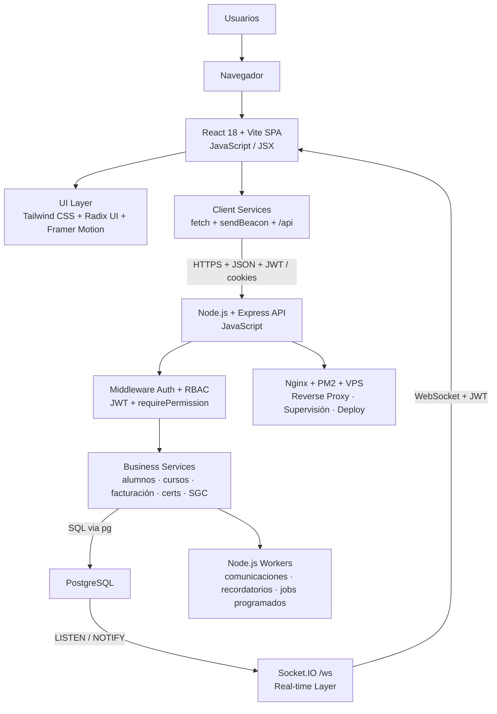
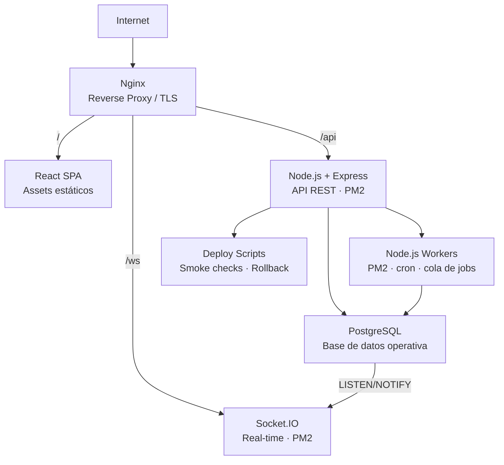
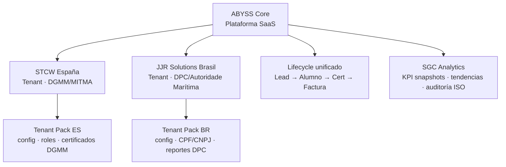
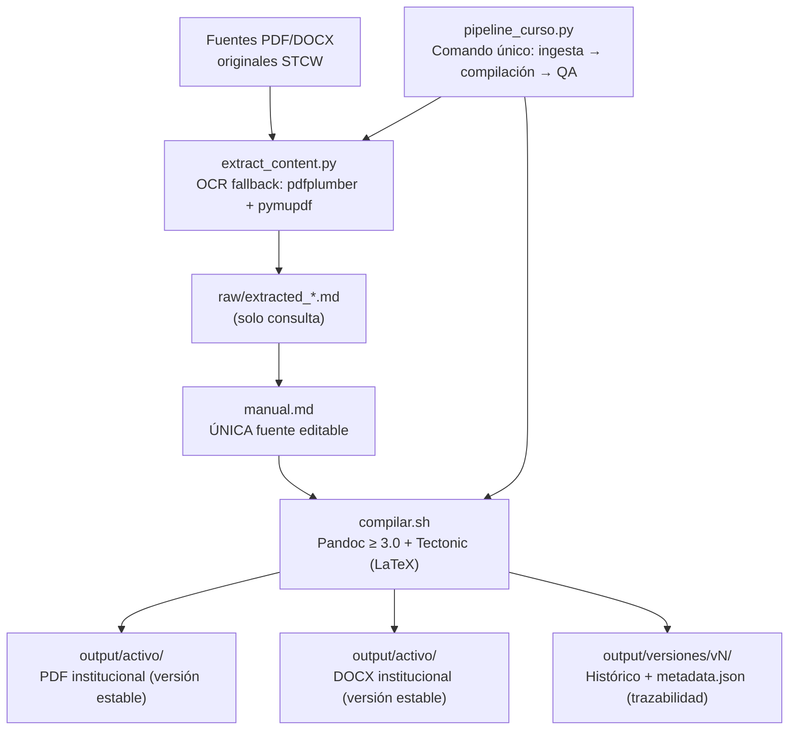
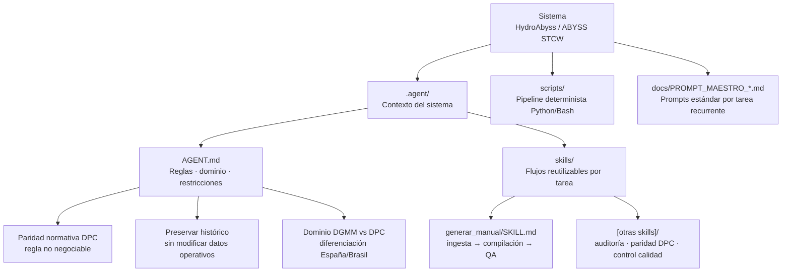
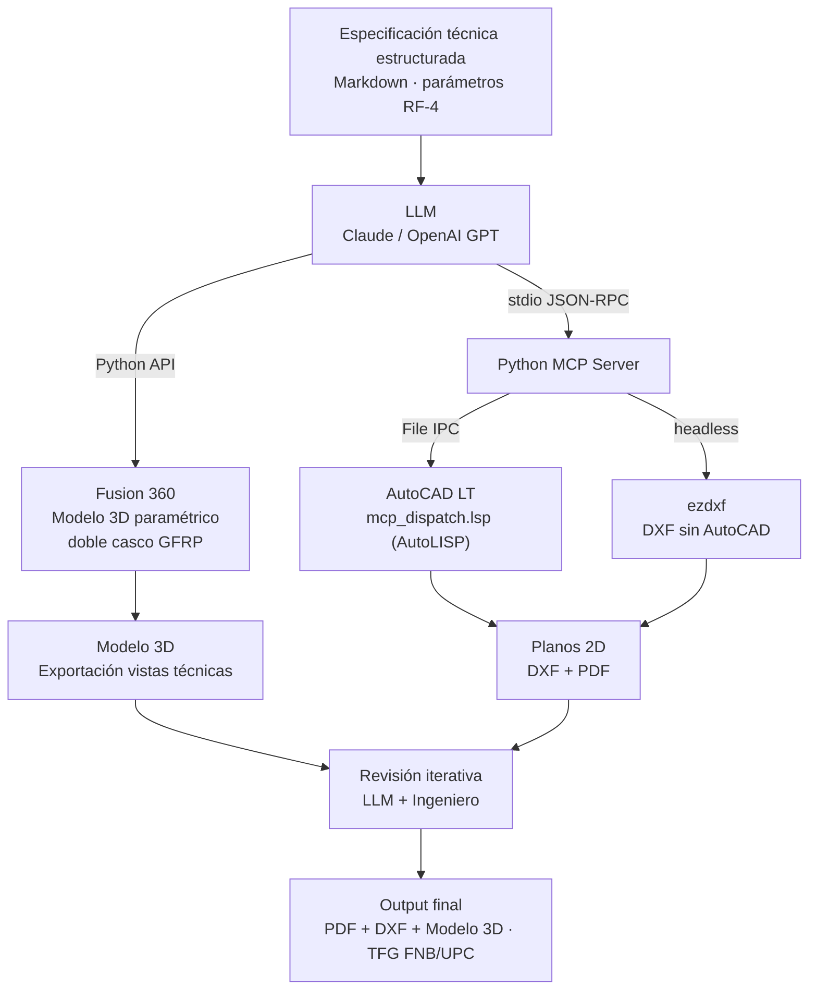

# Robert Garaban

**Software Architect · DevOps · Naval Engineer · Maritime Domain Specialist**

Ingeniero naval y arquitecto de software. Diseño y despliego sistemas SaaS de gestión marítima en producción, pipelines documentales con IA, herramientas de diseño naval asistido por LLM y agentes de IA especializados en el dominio STCW/DPC. Cada sistema va de la arquitectura al servidor.

Graduado en la **Facultat de Nàutica de Barcelona (UPC)** · Fundador técnico de **[HydroAbyss](https://hydroabyss.com)**

---

## 🛠️ Stack Tecnológico

### Backend & API

### Frontend

### Bases de Datos

### DevOps & Infraestructura

### Pipeline Documental

-008080?style=for-the-badge&logo=latex&logoColor=white)

### IA & LLM
-D97706?style=for-the-badge&logo=anthropic&logoColor=white)

-FF6B35?style=for-the-badge)

### CAD & Ingeniería Naval
-FF6C00?style=for-the-badge&logo=autodesk&logoColor=white)

-3776AB?style=for-the-badge&logo=python&logoColor=white)

---

## 🏗️ Arquitectura & DevOps

### ABYSS — Plataforma SaaS full-stack en producción

Stack React 18 + Vite · Node.js + Express · PostgreSQL · Socket.IO · Nginx · PM2 · VPS

---

### Infraestructura VPS — Topología de despliegue

---

### Plataforma Multi-Tenant — ABYSS (expansión geográfica)

---

### Pipeline Documental — Generador de Manuales STCW

---

### Integración Agentes IA — Arquitectura de dominio

---

### LLM + CAD — Diseño Naval RF-4

---

## 🚀 Proyectos Destacados

### 🚢 HydroAbyss — Plataforma marítima & escuela náutica

> Plataforma de negocio en producción: web de autoridad, captación de leads y sistema interno de gestión para escuela náutica (España). Arquitectura estática-first, backend PHP selectivo, contenido técnico multilingüe STCW.

🌐 Live: [hydroabyss.com](https://hydroabyss.com) · 📂 [`hydroabyss-showcase`](https://github.com/Robertgaraban/hydroabyss-showcase)

---

### ⚓ ABYSS STCW — Plataforma SaaS de formación marítima

> SaaS operativo con 5+ años de iteración en producción. 18 módulos: alumnos, cursos, certificaciones, facturación, portal alumno, comunicaciones, SGC/ISO. Arquitectura multi-tenant con tenant packs por país. Real-time via Socket.IO + PostgreSQL LISTEN/NOTIFY. Despliegue VPS con Nginx + PM2.

📂 [`abyss-stcw-brief`](https://github.com/Robertgaraban/abyss-stcw-brief)

---

### 🇧🇷 JJR Solutions — Sistema de gestión marítima (Brasil)

> Sistema operativo en producción para escuela de formación marítima en Brasil. Gestiona alumnos, cursos, certificaciones DPC, pagos e instructores bajo el marco regulatorio de la Autoridade Marítima brasileña. Integrado como segundo tenant de la plataforma ABYSS. Migración en 7 etapas completadas (hardening B→D→C→A).

🌐 Live: [jjrsolutions.site](https://jjrsolutions.site/system/session/) · 📂 [`jjr-showcase`](https://github.com/Robertgaraban/jjr-showcase)

---

### 📄 Generador de Manuales HydroAbyss

> Pipeline documental que genera los 21 manuales STCW en PDF y DOCX con calidad institucional, versionado automático y trazabilidad normativa. Extracción desde PDF/DOCX originales (con OCR fallback: pdfplumber + pymupdf) y compilación mediante Pandoc + Tectonic (LaTeX). Comando único por curso o ejecución masiva de lote.

-008080?style=flat-square&logo=latex&logoColor=white)

📂 [`manual-generator-showcase`](https://github.com/Robertgaraban/manual-generator-showcase)

---

### 💼 Sistema de Nóminas

> Sistema interno de gestión de nóminas, fichajes y control financiero por proyecto. Frontend React SPA + PHP REST API + MySQL. Kiosko de fichaje móvil con GPS. Control financiero por proyecto/semana. Módulo de reportes operativos.

🌐 Live: [nomina.atlantechmarine.com](https://nomina.atlantechmarine.com) · 📂 [`nominas-showcase`](https://github.com/Robertgaraban/nominas-showcase)

---

### 🤖 Agentes IA — HydroAbyss & ABYSS STCW

> Agentes de IA especializados con flujos de trabajo y reglas de dominio marítimo. Operan en producción para generación de manuales STCW, auditoría documental y control de paridad normativa. Arquitectura: AGENT.md (contexto del sistema) + skills reutilizables + pipeline determinista Python/Bash. Dominio cubierto: STCW · DGMM (España) · DPC (Brasil).

-D97706?style=flat-square)

📂 [`agents-showcase`](https://github.com/Robertgaraban/agents-showcase)

---

### ⚙️ LLM + Diseño Naval — HydroAbyss RF-4

> Integración de LLMs con Fusion 360 (Python API) y AutoCAD LT (via servidor MCP + AutoLISP) para generar planos técnicos navales desde especificaciones estructuradas. **Proyecto ejecutado:** Catamarán autónomo HydroAbyss RF-4 (4.80 m, doble casco GFRP, propulsión eléctrica 800 W, sensores LiDAR Ouster OS1-32 + GNSS RTK + AIS, autopiloto ArduPilot + MPC adaptativo, COLREGs-compliant). TFG presentado en la Facultat de Nàutica de Barcelona (UPC).

-FF6C00?style=flat-square&logo=autodesk&logoColor=white)

-D97706?style=flat-square)

📂 [`naval-design-llm-showcase`](https://github.com/Robertgaraban/naval-design-llm-showcase)

---

### 📐 Skill: Maquetación TFG FNB/UPC

> Skill de IA para formatear TFG/TFM según la normativa oficial de la Facultat de Nàutica de Barcelona (FNB/UPC). Aplica estilos Word, estructura obligatoria, tipografía, paginación, citación ISO 690 y figuras/tablas — sin reescribir el contenido del autor.

-2B579A?style=flat-square&logo=microsoftword&logoColor=white)

📂 [`tfg-skill-showcase`](https://github.com/Robertgaraban/tfg-skill-showcase)

---

### 🧮 Cálculo de Estructuras Navales

> Notebooks de ingeniería naval: cálculo estructural, estabilidad y resistencia aplicados a embarcaciones.

📂 [`Calculo-de-Estructuras-Navales-FNB`](https://github.com/Robertgaraban/Calculo-de-Estructuras-Navales-FNB)

---

## 🖥️ Capacidades como Arquitecto & DevOps

| Área | Evidencia |
|---|---|
| **Arquitectura SaaS multi-tenant** | ABYSS: tenant packs por país (España/Brasil), RBAC, lifecycle unificado, bootstrap por config |
| **Full-stack en producción** | React 18 + Vite · Node.js + Express · PostgreSQL · JWT · Socket.IO |
| **Despliegue VPS Linux** | Nginx (reverse proxy) · PM2 (supervisión de procesos) · scripts de deploy/rollback · smoke checks |
| **Real-time** | Socket.IO `/ws` sobre PostgreSQL `LISTEN/NOTIFY`, autenticación WebSocket con JWT |
| **Workers asincrónicos** | Node.js workers (`.js`/`.mjs`) para colas de comunicaciones, recordatorios, jobs programados |
| **Hardening de producción** | Post-mortems documentados · resolución de incidentes de autenticación · controles de workers · paridad normativa DPC |
| **Integración LLM + herramientas** | MCP stdio JSON-RPC · Fusion 360 Python API · AutoCAD AutoLISP · ezdxf headless |
| **Pipeline documental CI-style** | Pandoc + Tectonic · versionado automático · OCR fallback · QA por curso · ejecución en lote |
| **Agentes IA en producción** | AGENT.md por sistema · skills reutilizables · reglas de dominio no negociables · gate de calidad |
| **Dominio regulatorio** | STCW · DGMM/MITMA (España) · DPC/Autoridade Marítima (Brasil) · ISO/SGC |

---

## 📊 GitHub Stats

---

## 🗂️ Repositorios

Cada proyecto tiene dos capas: un **brief técnico público** (este repositorio y los showcases) y un **repositorio privado** con el código fuente completo, accesible como colaborador bajo solicitud.

| Proyecto | Showcase público | Estado |
|---|---|---|
| 🚢 HydroAbyss | [hydroabyss-showcase](https://github.com/Robertgaraban/hydroabyss-showcase) |  |
| ⚓ ABYSS STCW | [abyss-stcw-brief](https://github.com/Robertgaraban/abyss-stcw-brief) |  |
| 🇧🇷 JJR Solutions | [jjr-showcase](https://github.com/Robertgaraban/jjr-showcase) |  |
| 📄 Manual Generator | [manual-generator-showcase](https://github.com/Robertgaraban/manual-generator-showcase) |  |
| 💼 Nóminas | [nominas-showcase](https://github.com/Robertgaraban/nominas-showcase) |  |
| 🤖 Agentes IA | [agents-showcase](https://github.com/Robertgaraban/agents-showcase) |  |
| ⚙️ Naval Design LLM | [naval-design-llm-showcase](https://github.com/Robertgaraban/naval-design-llm-showcase) |  |
| 📐 TFG Skill | [tfg-skill-showcase](https://github.com/Robertgaraban/tfg-skill-showcase) |  |

**Para acceso a código fuente:** contacto disponible en los badges de la cabecera — Asunto: `[Acceso repo privado] <nombre-repo>`

---

*Arquitectura · DevOps · Formación marítima · Tecnología · Gestión operativa*

