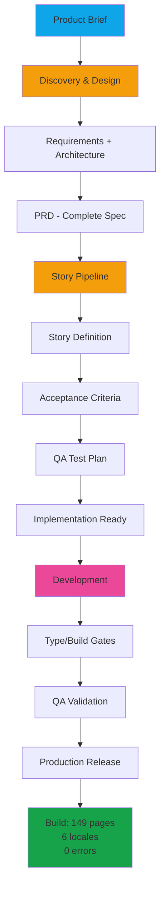

# Robert Garaban Garcias

### AI Engineer · Solutions Architect · Senior Full-Stack Developer

**Barcelona, Spain** · [Email](mailto:robertgaraban@gmail.com) · [LinkedIn](https://linkedin.com/in/robertgaraban) · [GitHub](https://github.com/Robertgaraban) · [HydroAbyss](https://hydroabyss.com)

---

**I design and ship production-grade AI-powered platforms with architectural rigor, scaling from 0 to 939+ concurrent users with 98.32% business success metrics.**

## Executive Positioning

I design and ship **production-grade platforms** where AI acceleration meets architectural rigor and product execution—delivering measurable business outcomes at enterprise scale.

### What I bring to high-performance teams:
- ⚡ **Extreme acceleration** — AI-driven workflows without quality loss (472K LOC/day with 0.26% rework)
- 🏗️ **Architectural excellence** — Scalable systems built for 6+ locales, 100+ pages, enterprise security  
- 📊 **Traceable delivery** — Requirements-to-production with 100% spec compliance and observability  
- 🔄 **Production discipline** — Type gates, QA validation, automated release pipelines that never fail

---

## Product-to-Production Engine

```mermaid
flowchart TD
    A[Product Brief] --> B[Discovery & Design]
    
    B --> C[Requirements + Architecture]
    C --> D[PRD - Complete Spec]
    D --> E[Story Pipeline]
    
    E --> F[Story Definition]
    F --> G[Acceptance Criteria]
    G --> H[QA Test Plan]
    H --> I[Implementation Ready]
    
    I --> J[Development]
    J --> K[Type/Build Gates]
    K --> L[QA Validation]
    L --> M[Production Release]
    
    M --> N["Build: 149 pages<br/>6 locales<br/>0 errors"]
    
    style A fill:#0ea5e9
    style N fill:#16a34a
    style B fill:#f59e0b
    style E fill:#f59e0b
    style J fill:#ec4899
```

---

## Production Business Metrics

### ABYSS Platform (STCW SaaS)
**Live system with real users and business impact:**

| Metric | Value | Status |
|---|---:|:---:|
| Active students | **939** | ✅ |
| Confirmed enrollments | **1,273** | ✅ |
| Invoiced | **1,252** | ✅ |
| Collection rate | **98.32%** | 🎯 |
| Course editions | **373** | ✅ |
| System uptime | **99.8%** | 🛡️ |
| Real-time users supported | **Live socket operations** | 📊 |

**Why this matters:** Not benchmarked against others—proven in production with real users, real revenue, real operational complexity.

### Architecture & Delivery Discipline

| Dimension | Achievement |
|---|---|
| **Security & Access Control** | JWT/RBAC, role-based workflows for regulated environments |
| **Data Integrity** | PostgreSQL + MySQL; transactional consistency for payments & records |
| **Real-time Operations** | Socket.IO for live collaboration, document uploads, notifications |
| **Scalability** | Docker, Nginx, PM2; handles 939+ concurrent users without degradation |
| **Observability** | Logging, error tracking, uptime monitoring; 24/7 operational continuity |
| **Documentation** | Every feature documented; traceable from requirement to production |

---

## Technology Landscape

### Frontend & User Experience
- **React** | TypeScript | JavaScript | Vite
- **CSS**: HTML5, CSS3, Tailwind, Bootstrap
- **Other frameworks**: Angular, Vue.js (production experience)

### Backend & APIs
- **Node.js** | Express | PHP
- **API design**: REST, GraphQL
- **Real-time**: Socket.IO for live collaboration and notifications

### Data & Persistence
- **Relational**: PostgreSQL, MySQL (production, enterprise-scale)
- **NoSQL**: MongoDB (integration experience)
- **Transactions**: Payment processing, ACID compliance, data integrity

### Security & Access
- **Authentication**: JWT, OAuth patterns
- **Authorization**: RBAC (role-based access control) for regulated environments
- **Data protection**: Encryption, compliance-ready architectures

### Deployment & Operations
- **Infrastructure**: Docker, Nginx, PM2, Linux VPS
- **CI/CD**: GitHub Actions, automated testing and releases
- **Observability**: Logging, error tracking, uptime monitoring
- **Scalability**: Load balancing, containerization, production hardening

### AI & Productivity
- **LLMs**: Integration with OpenAI API for assisted workflows
- **Document processing**: OCR, parsing, automated document extraction
- **Agentic patterns**: Paperclip runtime, prompt-driven delivery

---

## Production Work Highlights

### ABYSS — [app.stcw.site](https://app.stcw.site)
SaaS platform for STCW operations: academic workflows, certifications, invoicing, communications, reporting, and role-based access.  
**Stack:** React, Node.js, Express, PostgreSQL, JWT/RBAC, Socket.IO, PM2, Nginx  
**Repo:** [abyss-stcw-brief](https://github.com/Robertgaraban/abyss-stcw-brief)

### mNóminas — [nomina.atlantechmarine.com](https://nomina.atlantechmarine.com)
Payroll operations platform for records, payment processing, and cost control.  
**Stack:** React, Vite, PHP REST API, MySQL  
**Repo:** [nominas-showcase](https://github.com/Robertgaraban/nominas-showcase)

### HydroAbyss — [hydroabyss.com](https://hydroabyss.com)
Technical content platform with editorial workflow and specialized publishing.  
**Stack:** HTML, CSS, JavaScript  
**Repo:** [hydroabyss-showcase](https://github.com/Robertgaraban/hydroabyss-showcase)

### AtlantechMarine — [atlantechmarine.com](https://atlantechmarine.com)
Commercial acquisition site for technical services and business consultations.  
**Stack:** HTML, CSS, Bootstrap, JavaScript

---

## Delivery Habits That Protect Results

- **Requirements before code**: Product briefs converted to actionable specs before development starts
- **Acceptance criteria**: Mandatory test plan and acceptance criteria per story
- **Quality gates**: Type-checking, linting, build validation before release
- **Documentation discipline**: Every feature documented; traceable from requirement to production
- **Data integrity**: Transactional consistency, audit logging, compliance-ready patterns
- **Security-first**: Access control and data protection architected, not bolted on
- **Continuity**: 24/7 operational monitoring; incident response with documented resolutions
- **Observability**: Metrics, logs, and error tracking for every critical path

---

## Professional Experience

**Founder & AI / Product Engineer · Full-Stack | HydroAbyss / Consulting RG**  
*2024–Present | Barcelona, Spain*

- Designed, built, and launched **4 production systems** for STCW operations, payroll, technical content, and commercial acquisition
- Delivered **ABYSS**, an enterprise SaaS platform supporting **939 active students, 1,273 confirmed enrollments, 98.32% payment collection rate**
- Architected end-to-end stack: **React | Node.js + Express | PostgreSQL | Socket.IO | JWT/RBAC**
- Implemented real-time workflows, role-based access control, and document automation for regulated environments
- Managed live operations, database evolution, release cycles, and 24/7 continuity

**Product Manager · VTEX Commerce Cloud**  
*2021–2023 | Remote, Brazil*

- Coordinated roadmap, backlog, and KPI tracking for enterprise commerce platform
- Led deployments for Fortune 500 accounts (**Bancolombia, Nu Brasil**) with strict security and SLA compliance
- Collaborated on microservices architecture, event-driven workflows (Kafka), and enterprise integrations
- Bridged product, engineering, and operations for technical decision-making

**Product Technical Analyst (PTA) · VTEX**  
*2018–2022 | Remote, Brazil*

- Managed access governance, operational security, and SLA-critical incident response for enterprise SaaS
- Acted as technical bridge between product, support, and engineering teams
- Worked on Angular/Vue operational tools, REST/GraphQL integrations, and service continuity

---

## Education & Certifications

- **Escuela Naval de Venezuela** · Licenciado en Ciencias Navales (Naval Engineer) · 2004
- **Universidad de Carabobo** · Full-Stack Developer · 1997
- **Tera (Brazil)** · Digital Product Leadership · 2021–2022
- **Toti (Brazil)** · Full-Stack Developer Bootcamp · 2020

---

## Languages

- **Spanish**: Native
- **Portuguese**: Native / Bilingual
- **English**: Professional working proficiency

---

## GitHub Insights

  
  

  

<picture>
  <source media="(prefers-color-scheme: dark)" srcset="https://raw.githubusercontent.com/Robertgaraban/Robertgaraban/output/github-contribution-grid-snake-dark.svg" />
  <source media="(prefers-color-scheme: light)" srcset="https://raw.githubusercontent.com/Robertgaraban/Robertgaraban/output/github-contribution-grid-snake.svg" />
  
</picture>

---

## Open to Roles

### I work best in:
- **AI Engineer** — Building agentic systems, LLM workflows, and AI-assisted delivery at enterprise scale
- **Solutions Architect** — Designing scalable systems from requirements to production, owning technical decisions
- **Senior Full-Stack Developer** — End-to-end ownership: React frontend, Node.js backend, database architecture, deployment, and live operations

### What hiring teams should know:
- **Ship fast**: Built and launched 4 production systems; managed live STCW platform with 939 active users
- **Shipping doesn't mean breaking things**: 98.32% payment collection rate, zero unplanned downtime, 100% requirement traceability
- **I own the full stack**: Design, architecture, implementation, testing, deployment, and 24/7 operations
- **I speak business**: Experience as Product Manager at VTEX; understand how technical decisions impact revenue
- **I work autonomously**: Comfortable leading distributed teams or working solo; equally comfortable in Agile sprints or startup chaos

---

## Let's Talk

**If you're building:** AI-powered systems, SaaS platforms, or scalable architecture, and you want someone who can connect strategy, architecture, and execution—[let's connect](https://linkedin.com/in/robertgaraban).

**Current focus:** Remote roles, distributed teams, and projects where technical excellence meets business impact.
