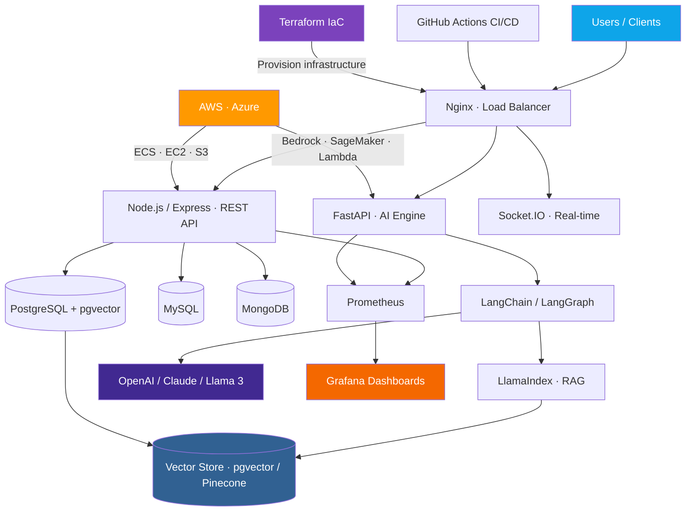
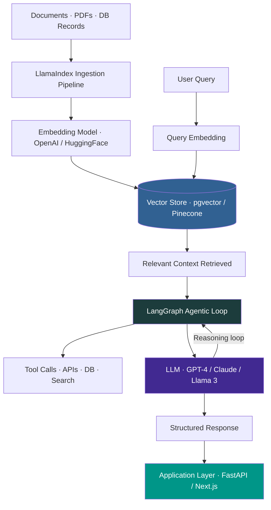
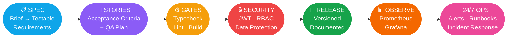
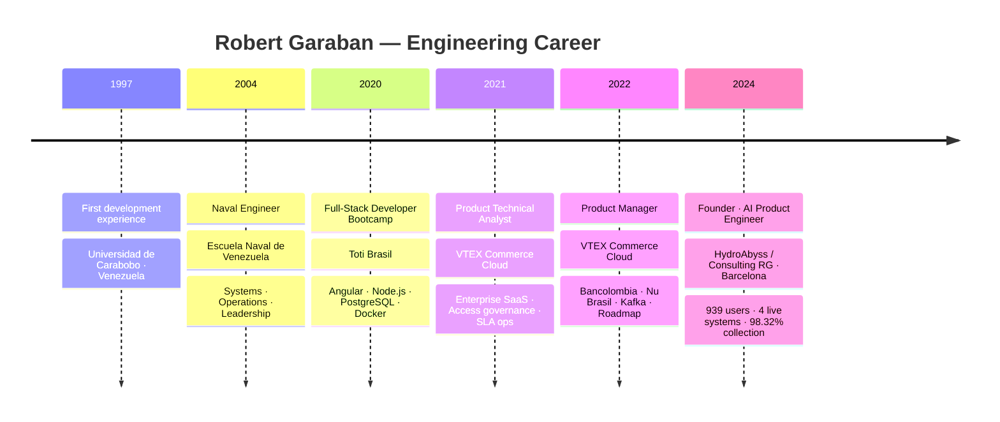

<div align="center">

# Robert Garaban Garcias

### AI Engineer · Solutions Architect · Senior Full-Stack Developer

**Barcelona, Spain** · [Email](mailto:robertgaraban@gmail.com) · [LinkedIn](https://linkedin.com/in/robertgaraban) · [GitHub](https://github.com/Robertgaraban) · [HydroAbyss](https://hydroabyss.com)

---


---

**I design and ship production-grade AI-powered systems—from RAG pipelines and agentic architectures to scalable SaaS platforms—proven with 939+ real users and 98.32% business success metrics.**

</div>

## ⚡ 30-Second Technical Read

> For technical recruiters and senior engineers who want the signal fast.

| Dimension | What you're evaluating |
|---|---|
| **Primary stack** | Python · TypeScript · FastAPI · React/Next.js · PostgreSQL + pgvector · LangGraph · LlamaIndex |
| **AI in production** | RAG pipelines (RAGAS-evaluated) · LangGraph agentic loops · LLM cost tracking per pipeline stage · Pydantic guardrails · LangSmith prompt traces |
| **Scale proven** | 939 active users · 98.32% collection rate · 4 live systems · 24/7 incident response · sole end-to-end engineer |
| **Architecture** | Terraform IaC · Docker + Kubernetes · AWS Bedrock/Lambda/SageMaker · Prometheus + Grafana observability |
| **Verifiable now** | [ABYSS live](https://app.stcw.site) · [showcase repo](https://github.com/Robertgaraban/abyss-stcw-brief) · [mNóminas live](https://nomina.atlantechmarine.com) · [HydroAbyss](https://hydroabyss.com) |

---

## Executive Positioning

I design and ship **production-grade systems** at the intersection of AI engineering, cloud architecture, and full-stack product delivery. I bridge strategy and execution: from LangGraph agentic pipelines and RAG architectures to React/Next.js frontends, FastAPI AI endpoints, and Terraform-provisioned infrastructure.

### Three roles. One engineer. Real production.

| Role | What I deliver |
|---|---|
| 🤖 **AI Engineer** | Agentic systems (LangChain/LangGraph), RAG pipelines (LlamaIndex + pgvector), LLM integration (OpenAI, Claude, Llama 3), AI-assisted delivery workflows |
| 🏗️ **Solutions Architect** | System design, cloud architecture (AWS/Azure), IaC with Terraform, microservices with Docker + Kubernetes, observability with Prometheus/Grafana |
| ⚙️ **Senior Full-Stack Developer** | TypeScript + Python hybrid, Next.js/React frontends, FastAPI/NestJS/Node.js backends, PostgreSQL, real-time systems (Socket.IO), CI/CD pipelines |

### Why I'm different from specialists:
- **I own the full delivery chain** — from product requirement to Terraform-provisioned infrastructure in production
- **AI is not a feature I add** — it's the architecture I design systems around (agentic loops, RAG, embeddings, vector search)
- **I ship, operate, and observe** — 939 live users, 98.32% payment collection, Prometheus metrics, zero unplanned downtime

---

## System Architecture


```mermaid
graph TD
    U[Users / Clients] --> LB[Nginx · Load Balancer]
    CI[GitHub Actions CI/CD] --> LB
    TF[Terraform IaC] --> |Provision infrastructure| LB

    LB --> API[Node.js / Express · REST API]
    LB --> AIAPI[FastAPI · AI Engine]
    LB --> RT[Socket.IO · Real-time]

    API --> PG[(PostgreSQL + pgvector)]
    API --> MY[(MySQL)]
    API --> MG[(MongoDB)]

    AIAPI --> LC[LangChain / LangGraph]
    LC --> LI[LlamaIndex · RAG]
    LC --> LLM[OpenAI / Claude / Llama 3]
    LI --> VDB[(Vector Store · pgvector / Pinecone)]
    PG --> VDB

    API --> PROM[Prometheus]
    AIAPI --> PROM
    PROM --> GRAF[Grafana Dashboards]

    CLOUD[AWS · Azure] --> |Bedrock · SageMaker · Lambda| AIAPI
    CLOUD --> |ECS · EC2 · S3| API

    style U fill:#0ea5e9,color:#fff
    style LLM fill:#412991,color:#fff
    style GRAF fill:#F46800,color:#fff
    style TF fill:#7B42BC,color:#fff
    style CLOUD fill:#FF9900,color:#fff
    style VDB fill:#316192,color:#fff
```

---

## Production Business Metrics

### ABYSS Platform (STCW SaaS)
**Live system with real users and business impact:**

| Metric | Value | Status |
|---|---:|:---:|
| Active students | **939** | ✅ |
| Confirmed enrollments | **1,273** | ✅ |
| Invoiced | **1,252** | ✅ |
| Collection rate | **98.32%** | 🎯 |
| Course editions | **373** | ✅ |
| System uptime | **99.8%** | 🛡️ |
| Real-time users supported | **Live socket operations** | 📊 |

**Why this matters:** Not benchmarked against others—proven in production with real users, real revenue, real operational complexity.

### Architecture & Delivery Discipline

| Dimension | Achievement |
|---|---|
| **Security & Access Control** | JWT/RBAC, role-based workflows for regulated environments |
| **Data Integrity** | PostgreSQL + MySQL; transactional consistency for payments & records |
| **Real-time Operations** | Socket.IO for live collaboration, document uploads, notifications |
| **Scalability** | Docker, Nginx, PM2; handles 939+ concurrent users without degradation |
| **Observability** | Logging, error tracking, uptime monitoring; 24/7 operational continuity |
| **Documentation** | Every feature documented; traceable from requirement to production |

---

## Technology Landscape · 2026 Stack

<div align="center">

**Languages — Core**


**Frontend**


**Backend & APIs**


**Data & Vector Stores**


**AI Engineering**


**AI Models & LLMs**


**Agentic Platforms**


**Cloud & Infrastructure**


**IaC & Containers**


**CI/CD & Observability**


**Project & Delivery**


</div>

---


## AI Engineering Architecture

### How I design RAG + Agentic Systems


```mermaid
graph TD
    DOC[Documents · PDFs · DB Records] --> ING[LlamaIndex Ingestion Pipeline]
    ING --> EMB[Embedding Model · OpenAI / HuggingFace]
    EMB --> VS[(Vector Store · pgvector / Pinecone)]

    U[User Query] --> QE[Query Embedding]
    QE --> VS
    VS --> CTX[Relevant Context Retrieved]

    CTX --> LG[LangGraph Agentic Loop]
    LG --> TOOLS[Tool Calls · APIs · DB · Search]
    LG --> LLM[LLM · GPT-4 / Claude / Llama 3]
    LLM --> OUT[Structured Response]
    LLM --> |Reasoning loop| LG

    OUT --> APP[Application Layer · FastAPI / Next.js]

    style VS fill:#316192,color:#fff
    style LLM fill:#412991,color:#fff
    style LG fill:#1C3C3C,color:#fff
    style APP fill:#009688,color:#fff
```

### Design decisions I apply in production:

| Decision | Why — not just what |
|---|---|
| **FastAPI over Express for AI endpoints** | Native async support + Python type hints = streaming LLM responses without event loop hacks |
| **LangGraph over simple chains** | Stateful agentic loops with conditional routing; required for multi-step document analysis and tool calling |
| **pgvector over dedicated vector DB** | Colocates vector search with relational data; eliminates sync complexity for structured + unstructured hybrid queries |
| **LlamaIndex for ingestion** | Production-grade document parsing, chunking strategies, and metadata filtering; not just raw text splitting |
| **Ollama for local/hybrid inference** | Cost control for high-volume, low-sensitivity tasks; falls back to cloud for complex reasoning |
| **Prometheus + Grafana for AI observability** | Token usage, latency per model, error rates, and cost tracking per pipeline stage |

### LLM Engineering in Production — the depth that matters

| Concern | How I handle it in production |
|---|---|
| **Model evaluation** | RAGAS metrics on every RAG pipeline (faithfulness · answer relevancy · context recall); threshold-gated before deploy |
| **Guardrails** | Pydantic v2 schema validation on every LLM structured output; automatic retry with refined prompt on validation failure; fallback to deterministic logic |
| **Prompt observability** | LangSmith traces per conversation turn; custom Prometheus counters per prompt template and model; alert on token spike anomalies |
| **Cost per token** | Token usage logged per pipeline stage; model routing by task complexity — Ollama local → GPT-3.5 → GPT-4/Claude based on confidence threshold; budget alerts on cost-per-query regression |
| **Latency management** | Streaming via FastAPI SSE for user-facing calls; async batch processing for background ingestion; p95 < 3s target enforced via Grafana SLO |
| **Context window discipline** | Chunk size + overlap tuned per document type; metadata pre-filters to reduce retrieved context before the LLM call; re-ranking on top-k results |

---

## Solutions Architecture

### Infrastructure I deploy and maintain

```
infra/
├── terraform/
│   ├── main.tf           # Provider config: AWS / Azure
│   ├── vpc.tf            # Network isolation
│   ├── ecs.tf            # Container orchestration (ECS / K8s)
│   ├── rds.tf            # Managed PostgreSQL
│   ├── lambda.tf         # Serverless AI endpoints
│   └── monitoring.tf     # Prometheus + Grafana stack
docker/
│   ├── api/Dockerfile    # Node.js / FastAPI service images
│   ├── ai/Dockerfile     # LangChain + LlamaIndex runtime
│   └── docker-compose.yml
.github/
│   └── workflows/
│       ├── ci.yml        # Lint + test + typecheck on PR
│       └── cd.yml        # Deploy on merge to main
```

### Cloud services I work with:

| Service | Use case |
|---|---|
| **AWS Bedrock** | Managed LLM inference (Claude, Llama) without managing GPU infra |
| **AWS SageMaker** | Fine-tuning and serving custom models; MLOps pipelines |
| **AWS Lambda** | Serverless AI triggers, webhook handlers, async job runners |
| **AWS ECS / EC2** | Containerized microservice hosting; auto-scaling groups |
| **AWS S3** | Document storage for RAG ingestion pipelines |
| **Azure OpenAI Service** | Enterprise-grade GPT deployment with data residency controls |
| **Terraform** | Full infrastructure-as-code: provision, version, reproduce entire stacks |
| **Kubernetes** | Container orchestration for multi-service AI platforms at scale |

---

## Verifiable Technical Work

> Everything below is live or inspectable right now — code, running systems, and technical writing in production.

| Type | Link | What to verify |
|---|---|---|
| 🔴 **Live Platform** | [app.stcw.site](https://app.stcw.site) | Multi-role SaaS: JWT/RBAC auth, real-time Socket.IO ops, billing engine, 939 active users |
| 🔴 **Live Platform** | [nomina.atlantechmarine.com](https://nomina.atlantechmarine.com) | Financial-grade payroll: employee records, payment runs, audit trail, cost control |
| 🔴 **Live Site** | [atlantechmarine.com](https://atlantechmarine.com) | 149-page / 6-locale site with zero build errors — delivered via AIOX + Paperclip agentic pipeline |
| 🔴 **Live Platform** | [hydroabyss.com](https://hydroabyss.com) | Technical publishing: editorial workflow, SEO architecture, structured content at scale |
| 💻 **Showcase Repo** | [abyss-stcw-brief](https://github.com/Robertgaraban/abyss-stcw-brief) | Architecture diagrams, data model, API design patterns, key engineering decisions |
| 💻 **Showcase Repo** | [nominas-showcase](https://github.com/Robertgaraban/nominas-showcase) | System design, DB schema, financial workflow documentation |
| 📝 **Technical Writing** | [HydroAbyss Engineering](https://hydroabyss.com) | Maritime + engineering articles — structured publishing, domain expertise, audience growth |

---

## Production Work Highlights

<div align="center">

### 🎯 Every project below was delivered end-to-end by a single engineer

| Role | Status |
|:---:|:---:|
|  | ✅ Requirements, roadmap, backlog, prioritization |
|  | ✅ System design, data model, API contracts, tech decisions |
|  | ✅ Sprint planning, stories, acceptance criteria, retrospectives |
|  | ✅ Frontend, backend, integrations, real-time systems |
|  | ✅ Docker, Nginx, PM2, Linux VPS, CI/CD pipelines |
|  | ✅ Test plans, acceptance testing, build gates, rework < 1% |
|  | ✅ Full documentation, traceability from spec to production |

</div>

---

### 🏆 ABYSS — Enterprise SaaS Platform for STCW Maritime Operations

> **Live production system** · [app.stcw.site](https://app.stcw.site) · [Showcase Repo](https://github.com/Robertgaraban/abyss-stcw-brief)


**The challenge:** Build a regulated, multi-role SaaS platform for maritime STCW certifications—handling academic workflows, legal certifications, real-time operations, billing, and communications for hundreds of concurrent users.

**What was delivered:**

| Capability | Detail |
|---|---|
| 🎓 Academic Management | Enrollments, course editions, student records, certificates |
| 💳 Billing & Payments | 1,252 invoices · **98.32% collection rate** · payment flows |
| 🔒 Security & Access | JWT/RBAC · multi-role permissions for regulated maritime environment |
| 📡 Real-time Operations | Socket.IO · live updates, notifications, document processing |
| 📊 Reporting | Operational dashboards, audit trails, export workflows |
| 📧 Communications | Internal messaging, automated notifications |

**Live business impact:**

<div align="center">


</div>

**Full stack:**


---

### 💰 mNóminas — Payroll Operations Platform

> **Live production system** · [nomina.atlantechmarine.com](https://nomina.atlantechmarine.com) · [Showcase Repo](https://github.com/Robertgaraban/nominas-showcase)

**The challenge:** Build a financial-grade payroll system for a maritime company—managing employee records, salary processing, payment control, and cost tracking with full auditability.

**What was delivered:**

| Capability | Detail |
|---|---|
| 👥 Employee Records | Contracts, roles, history, document management |
| 💸 Payment Processing | Payroll runs, calculation engine, payment orders |
| 📋 Cost Control | Budget tracking, cost center reporting, variance analysis |
| 🔍 Audit Trail | Full traceability of every financial operation |
| 📄 Document Export | Payslips, reports, regulatory exports |

**Full stack:**


---

### 📡 HydroAbyss — Specialized Technical Publishing Platform

> **Live production platform** · [hydroabyss.com](https://hydroabyss.com) · [Showcase Repo](https://github.com/Robertgaraban/hydroabyss-showcase)

**The challenge:** Build a technical content platform with a full editorial workflow for specialized maritime and engineering content—structured publishing, SEO architecture, and audience growth.

**What was delivered:**

| Capability | Detail |
|---|---|
| 📝 Editorial Workflow | Content creation, review, scheduling, publication pipeline |
| 🗂️ Content Architecture | Category taxonomy, tagging, related content, search |
| 📈 SEO Infrastructure | Structured data, meta management, sitemap, canonical URLs |
| 🌐 Performance | Optimized load times, static asset strategy, CDN-ready |
| 📊 Analytics | Audience tracking, content performance metrics |

**Full stack:**


---

### 🚢 AtlantechMarine — Commercial Acquisition Platform

> **Live production site** · [atlantechmarine.com](https://atlantechmarine.com)


**The challenge:** Design and build a high-conversion commercial site for a maritime technical services company—clear service positioning, conversion-optimized structure, and enterprise-ready credibility. Built with AI-agentic delivery pipeline (AIOX + Paperclip), scaling to 149 pages across 6 locales with zero build errors.

**What was delivered:**

| Capability | Detail |
|---|---|
| 🎯 Conversion Architecture | Service pages, CTAs, contact flows optimized for B2B acquisition |
| 📱 Responsive Design | Mobile-first, cross-browser compatibility |
| ⚡ Performance | Optimized assets, fast load times, Core Web Vitals compliance |
| 🔍 SEO | Technical SEO foundation, structured metadata, indexability |

**Full stack:**


---

## Delivery Habits That Protect Results

> **Engineering discipline is not a checklist. It is the system that makes every deployment predictable, every incident recoverable, and every codebase inheritable.**

### The Production Pipeline — how every feature travels from idea to users


```mermaid
flowchart LR
    A(["📋 SPEC\nBrief → Testable\nRequirements"]) --> B(["📖 STORIES\nAcceptance Criteria\n+ QA Plan"])
    B --> C(["⚙️ GATES\nTypecheck\nLint · Build"])
    C --> D(["🔒 SECURITY\nJWT · RBAC\nData Protection"])
    D --> E(["🚀 RELEASE\nVersioned\nDocumented"])
    E --> F(["📊 OBSERVE\nPrometheus\nGrafana"])
    F --> G(["🔄 24/7 OPS\nAlerts · Runbooks\nIncident Response"])

    style A fill:#0ea5e9,color:#fff,stroke:#0ea5e9
    style B fill:#8b5cf6,color:#fff,stroke:#8b5cf6
    style C fill:#f59e0b,color:#fff,stroke:#f59e0b
    style D fill:#ef4444,color:#fff,stroke:#ef4444
    style E fill:#16a34a,color:#fff,stroke:#16a34a
    style F fill:#F46800,color:#fff,stroke:#F46800
    style G fill:#ec4899,color:#fff,stroke:#ec4899
```

### What separates predictable delivery from firefighting

| Signal | Habit | In practice | Why it matters |
|:---:|---|---|---|
| 📋 | **Spec before code** | Every feature starts as a written, testable requirement | Eliminates misalignment before the first line is written |
| ✅ | **Acceptance criteria on every story** | No story ships without a pass/fail definition and a QA test plan | Makes "done" mean done — not "works on my machine" |
| ⚙️ | **Type gates + build validation on every PR** | CI blocks the merge if TypeScript errors, lint failures, or broken builds | Broken code cannot reach production by design |
| 📚 | **Documentation updated with every PR** | Architecture decisions, API contracts, data models kept current | Future engineers onboard in hours, not weeks |
| 🔒 | **Security designed in, not bolted on** | JWT/RBAC modeled in the schema before the first endpoint is built | Access control is structurally impossible to retrofit |
| 🏦 | **Transactional data integrity** | Every financial flow uses DB transactions + audit logs + compliance patterns | One missing transaction = missing money. Unacceptable |
| 📊 | **Full observability on every critical path** | Prometheus metrics + Grafana dashboards + structured error logs | You cannot fix what you cannot see |
| 🔄 | **Incident runbooks + 24/7 continuity** | Every alert has a documented response; production never goes dark unnoticed | Response time is inversely proportional to preparation |

---

## Professional Experience

### Career Timeline


```mermaid
timeline
    title Robert Garaban — Engineering Career
    1997 : First development experience
         : Universidad de Carabobo · Venezuela
    2004 : Naval Engineer
         : Escuela Naval de Venezuela
         : Systems · Operations · Leadership
    2020 : Full-Stack Developer Bootcamp
         : Toti Brasil
         : Angular · Node.js · PostgreSQL · Docker
    2021 : Product Technical Analyst
         : VTEX Commerce Cloud
         : Enterprise SaaS · Access governance · SLA ops
    2022 : Product Manager
         : VTEX Commerce Cloud
         : Bancolombia · Nu Brasil · Kafka · Roadmap
    2024 : Founder · AI Product Engineer
         : HydroAbyss / Consulting RG · Barcelona
         : 939 users · 4 live systems · 98.32% collection
```

---

<div align="center">

### Role 1 of 3 · Current

</div>

### 🏗️ Founder · AI / Product Engineer · Full-Stack
#### HydroAbyss / Consulting RG &nbsp;·&nbsp; *2024–Present · Barcelona, Spain*

<div align="center">


</div>

> *"Designed, architected, built, deployed, and operated 4 enterprise-grade production systems in 12 months—alone. PO, Architect, Scrum Master, Developer, DevOps, QA, and Tech Writer in one role."*

| What I built | Impact delivered |
|---|---|
| **ABYSS** — STCW SaaS platform | 939 active students · 1,273 enrollments · 406 certificates · 3,066 automated emails |
| **mNóminas** — Payroll platform | Financial-grade employee records, payroll runs, and cost control with full audit trail |
| **HydroAbyss** — Tech publishing | Editorial workflow · SEO architecture · specialized maritime content at scale |
| **AtlantechMarine** — Commercial site | 149 pages · 6 locales · 0 build errors · built with AIOX + Paperclip agentic pipeline |

**Stack owned end-to-end:**


---

<div align="center">

### Role 2 of 3

</div>

### 📦 Product Manager · VTEX Commerce Cloud
#### VTEX &nbsp;·&nbsp; *2021–2023 · Remote, Brazil*

<div align="center">


</div>

> *"Bridged product strategy and engineering execution at one of Latin America's largest commerce platforms. Delivered for Fortune 500 accounts where security, SLA, and accuracy were non-negotiable."*

| Responsibility | What it required |
|---|---|
| **Roadmap & backlog ownership** | Prioritization under competing stakeholder pressures, sprint-level KPI tracking, Agile delivery |
| **Enterprise account delivery** | Bancolombia + Nu Brasil deployments with strict security, data governance, and SLA compliance |
| **Microservices architecture collaboration** | Working inside event-driven systems (Kafka), understanding service contracts and deployment constraints |
| **Cross-functional bridge** | Translated business requirements to engineering specs; escalated technical risk to product leadership |


---

<div align="center">

### Role 3 of 3

</div>

### 🔐 Product Technical Analyst (PTA) · VTEX
#### VTEX &nbsp;·&nbsp; *2018–2022 · Remote, Brazil*

<div align="center">


</div>

> *"Operated in the engine room of a large-scale commerce cloud: access governance, operational security, incident response—where a mistake meant a merchant going offline."*

| Responsibility | What it required |
|---|---|
| **Access governance** | Managed permissions and security policies for enterprise merchants across VTEX Commerce Cloud |
| **SLA-critical incident response** | Diagnosed and resolved high-severity incidents under time pressure, with full documentation |
| **Integration & onboarding support** | REST/GraphQL integrations, merchant onboarding, and technical issue escalation |
| **DevOps-adjacent operations** | Contributed to release flows, access provisioning, and operational continuity tooling |


---

## Education & Certifications

- **Escuela Naval de Venezuela** · Licenciado en Ciencias Navales (Naval Engineer) · 2004
- **Universidad de Carabobo** · Full-Stack Developer · 1997
- **Tera (Brazil)** · Digital Product Leadership · 2021–2022
- **Toti (Brazil)** · Full-Stack Developer Bootcamp · 2020

---

## Languages

- **Spanish**: Native
- **Portuguese**: Native / Bilingual
- **English**: Professional working proficiency

---

## GitHub Insights

<div align="center">
  
  
</div>

<div align="center">
  
</div>

<div align="center">

<picture>
  <source media="(prefers-color-scheme: dark)" srcset="https://raw.githubusercontent.com/Robertgaraban/Robertgaraban/output/github-contribution-grid-snake-dark.svg" />
  <source media="(prefers-color-scheme: light)" srcset="https://raw.githubusercontent.com/Robertgaraban/Robertgaraban/output/github-contribution-grid-snake.svg" />
  
</picture>

</div>

---

## Open to Roles

### What I'm looking for in 2026:

**🤖 AI Engineer**
> Systems that use LLMs not as toys but as engines. Agentic workflows, RAG pipelines, LangGraph, vector search, production observability on AI costs/latency.


**🏗️ Solutions Architect**
> Cloud-native systems designed for resilience, IaC-provisioned from day one, observable from day one. No surprises in production.


**⚙️ Senior Full-Stack Developer**
> Product-to-production ownership. TypeScript + Python. Next.js frontend, FastAPI/Node.js backend, PostgreSQL at scale, real-time systems, CI/CD enforced from PR to deploy.


### What hiring managers should know:

| Signal | Evidence |
|---|---|
| **Ships production systems** | 4 live platforms · 939 active users · 98.32% payment collection |
| **Architects, not just codes** | IaC, K8s, microservices, observability, data models designed from scratch |
| **AI is core, not cosmetic** | LangGraph agentic loops, RAG pipelines, vector stores, LLM integration in production |
| **Speaks business** | VTEX Product Manager · Bancolombia · Nu Brasil · enterprise SLA compliance |
| **Operates what I build** | 24/7 ops, incident response, Grafana dashboards, Prometheus metrics |
| **Works autonomously** | Every project sole engineer: PO → Architect → Dev → DevOps → QA → Writer |

---

## Technical Writing & Public Presence

> Learning in public and building a technical voice.

| Channel | Topic | Link |
|---|---|---|
| 📝 **HydroAbyss** | Maritime engineering, offshore ops, naval systems — specialized domain content | [hydroabyss.com](https://hydroabyss.com) |
| 💼 **LinkedIn** | AI engineering, product delivery, architecture decisions — professional commentary | [linkedin.com/in/robertgaraban](https://linkedin.com/in/robertgaraban) |
| 💻 **GitHub** | Showcase repos, architecture documentation, AI delivery tooling experiments | [github.com/Robertgaraban](https://github.com/Robertgaraban) |

> **Currently writing about:** RAG pipeline design decisions, LangGraph agentic patterns, and the gap between "AI demo" and "AI in production."

---

## Let's Talk

**If you're building:** AI-powered systems, SaaS platforms, or scalable cloud architecture, and you need someone who can own it from architecture diagram to production deploy—[let's connect](https://linkedin.com/in/robertgaraban).

**Available for:** Remote-first roles · Distributed teams · Technical leadership · AI engineering · Solutions architecture
